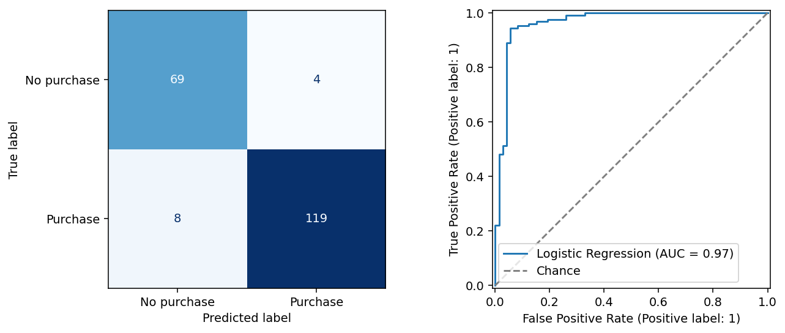
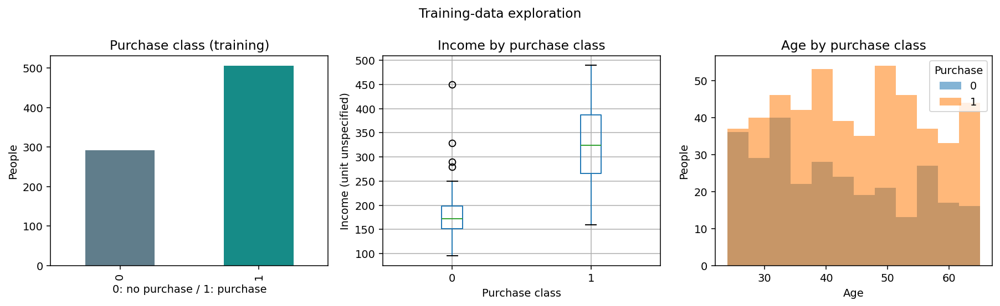

# Customer Car Purchase Prediction

An educational marketing analytics case study using Logistic Regression.

**Author:** Rifqiy Akmal | **Tools:** Python, pandas, scikit-learn, Matplotlib

## Business question

Can the supplied demographic and financial attributes distinguish car buyers from non-buyers? The potential use case is prioritizing prospects for review. This project does not demonstrate marketing savings or predict a documented future purchase window.

## Results

Stratified 80/20 split with `random_state=0`, after excluding two implausible age records. The holdout contains 200 records. Classification metrics use a 0.5 threshold; ROC-AUC uses probabilities.

| Model | Accuracy | Precision | Recall | F1 | ROC-AUC |
|---|---:|---:|---:|---:|---:|
| Majority baseline | 0.6350 | 0.6350 | 1.0000 | 0.7768 | 0.5000 |
| Logistic Regression | 0.9400 | 0.9675 | 0.9370 | 0.9520 | 0.9660 |

Five-fold training cross-validation ROC-AUC: **0.9809 ± 0.0091** (mean ± standard deviation). See [holdout metrics](reports/test_metrics.csv) and [cross-validation metrics](reports/cv_metrics.csv).



Precision describes the reliability of flagged buyers; recall describes how many recorded buyers are found. The model outperforms the majority baseline on this holdout. These results replace the old scores because the split and preprocessing changed.

## Data dictionary

The supplied `calonpembeli_ch5.csv` has 1,000 rows; 998 remain after cleaning (633 buyers and 365 non-buyers). The original publisher, collection date, license, and whether the data are synthetic are unverified. The CSV is retained from the original repository; confirm provenance before external reuse.

| Field | Treatment | Meaning / limitation |
|---|---|---|
| ID | Excluded | Row identifier |
| Usia | Scaled numeric | Age, presumed years |
| Status | One-hot encoded | Codes 0–3; meanings unknown |
| Kelamin | One-hot encoded | Gender codes 0/1; mapping unknown |
| Memiliki_Mobil | Scaled numeric | Values 0–4; provisionally a count, definition unverified |
| Penghasilan | Scaled numeric | Income; currency and time unit unknown |
| Beli_Mobil | Binary target | 1: purchase; 0: no purchase; timing unknown |

## Analysis workflow

1. Check missing values, IDs, target values, and age plausibility.
2. Apply the documented adult-age assumption (18–100), excluding two records.
3. Split before exploration; perform EDA on training data only.
4. Fit scaling and categorical encoding inside a Logistic Regression pipeline.
5. Compare a majority baseline and five-fold cross-validation, then evaluate the holdout.
6. Interpret results, limitations, and possible business use.



See the [executed notebook](notebooks/customer_purchase_prediction.ipynb) for explanations, outputs, and coefficient interpretation.

## Run locally

Python 3.12 was used for this revision.

```bash
git clone https://github.com/akmalrfy/customer-purchase-prediction.git
cd customer-purchase-prediction
python -m venv .venv
```

Activate with `source .venv/bin/activate` (macOS/Linux) or `.venv\Scripts\activate` (Windows), then:

```bash
python -m pip install -r requirements.txt
python -m jupyterlab
```

Open `notebooks/customer_purchase_prediction.ipynb` and run all cells. Paths work from the repository root or `notebooks/`. Charts and metrics refresh in `assets/` and `reports/`.

## Repository contents

- `data/`: supplied CSV
- `notebooks/`: documented analysis and saved outputs
- `assets/`: charts
- `reports/`: evaluation tables
- `requirements.txt`: dependencies

## Limitations and next steps

A random holdout does not establish performance on future customers. Features must be known before purchase: ownership could leak the target if recorded afterward, and this cannot be resolved without source documentation. Coefficients describe associations, not causal effects; scaled numeric coefficients and categorical reference effects need separate interpretation. Age and gender require fairness assessment before operational use.

Next steps: verify provenance and category definitions, evaluate on future records, assess calibration and subgroup performance, and choose a threshold using validation data and actual outreach costs. No measured marketing ROI or cost reduction is claimed.
